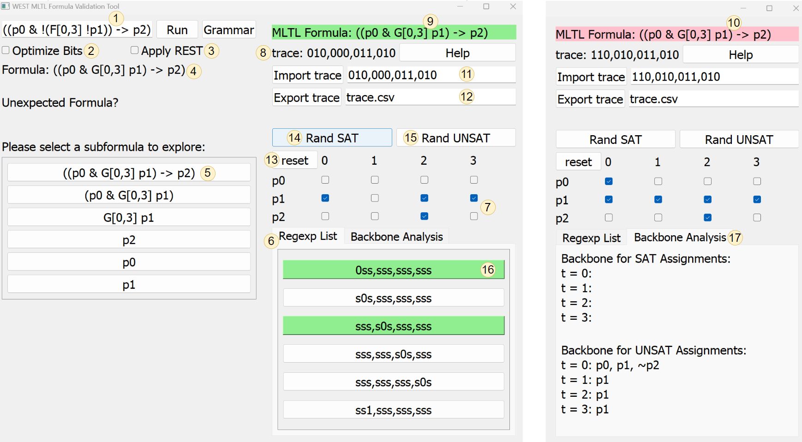

# WEST - Mission-time Linear Temporal Logic Tool

The WEST package generates **regular expressions** describing all satisfying computations for [Mission-time Linear Temporal Logic (MLTL) formulas](https://link.springer.com/chapter/10.1007/978-3-030-25543-5_1#Sec2), with formal verification via Isabelle/HOL theorem prover.

🔗 **Links:** [Paper](https://temporallogic.org/research/WEST/WEST_extended.pdf) | [Formal Verification](https://arxiv.org/abs/2501.17444) | [Website](https://west.temporallogic.org/)

---

## Quick Start

### Command Line Tool

```bash
git clone <this-repo>
cd WEST
./setup.sh
./bin/west "p0"  # Test with simple formula
```

### GUI Interface

The setup script automatically prepares the Python environment with GUI dependencies:

```bash
# After running ./setup.sh above
source west_env/bin/activate  # Activate Python environment
python gui.py                 # Run the GUI
```


---

## Installation Levels

### Level 1: Core WEST Tool Only (RECOMMENDED)
- **What you get:** Command-line WEST executable
- **Dependencies:** Just g++ compiler  
- **Install:** `make clean && make`
- **Use case:** Basic MLTL formula processing

### Level 2: + GUI Interface
- **What you get:** Core + graphical interface
- **Dependencies:** Core + Python + PyQt5
- **Install:** 
  ```bash
  ./setup.sh  # Automatically sets up Python environment and GUI
  ```
- **Usage:**
  ```bash
  source west_env/bin/activate
  python gui.py
  ```
- **Use case:** Interactive formula editing and visualization

### Level 3: + Verification Suite
- **What you get:** Core + all verification tools (string, interpreter, AllSAT, R2U2, Isabelle)
- **Dependencies:** Core + Python + GHC Haskell compiler
- **Install:**
  ```bash
  cd experiments/verification
  python verify_isabelle.py  # Auto-installs Python deps
  ./setup_verification.sh    # Sets up Haskell components
  ```
- **Use case:** Formal verification and correctness testing

### Level 4: + Benchmarking & Research
- **What you get:** Everything + performance testing and plotting
- **Dependencies:** All previous + matplotlib, numpy
- **Install:** See `experiments/benchmarking/requirements.txt` for dependencies
- **Use case:** Performance analysis and research experiments

---

## System Requirements

**Minimum (Level 1):**
- g++ with C++17 support
- Make

**Level 2-4 additions:**
- Python 3.7+
- pip

**Level 3-4 additions:**
- GHC Haskell compiler (for Isabelle verification)

---

## Testing Your Installation

After installation, verify everything works:

```bash
# Test core functionality
./bin/west "p0"

# Test GUI (if installed)
python gui.py

# Test verification (if installed)
cd experiments/verification && python verify_isabelle.py "p0"
```

---

## Troubleshooting

**Compilation fails?**
- Ensure g++ supports C++17: `g++ --version`
- Try: `sudo apt install build-essential` (Ubuntu/Debian)

**Python import errors?**
- Check Python version: `python --version` (need 3.7+)
- Install missing packages: `pip install <package-name>`

**GUI won't start?**
- Install Qt5: `sudo apt install qt5-default` (Linux)
- Try: `pip install --upgrade PyQt5`

## What's Included

- **WEST Core Tool** - Command-line MLTL to regex converter
- **GUI Interface** - Visual formula editor and trace visualization  
- **Verification Suite** - Formal verification with Isabelle/HOL + comprehensive testing
- **Benchmarking Tools** - Performance analysis and experimental validation

## MLTL Syntax Examples

**Basic operators:**
- Propositional variable: `p0`
- And: `p0 & p1`
- Or: `p0 | p1`
- Implication: `p0 -> p1`
- Negation: `!p0`

**Temporal operators:**
- Globally: `G[0,3] p1`
- Future: `F[0,3] p1`
- Until: `p0 U[0,3] p1`
- Release: `p0 R[0,3] p1`

**Complex example:** `((p0 & G[0,3]p1)->p2)`
*"If p0 is true initially and p1 stays true for 4 time-steps, then p2 must be true initially."*

---

## GUI Overview



The GUI provides:
1. Formula input and validation
2. Trace visualization and testing  
3. Regular expression generation
4. Interactive truth table evaluation
5. Trace import/export capabilities
6. Random trace generation
7. Backbone analysis

---

## Contributors

WEST development began as part of the [2022 Iowa State Math REU](https://reu.math.iastate.edu/projects.html#ROZIER) with mentors [Kristin Yvonne Rozier](https://www.aere.iastate.edu/kyrozier/) and [Laura Gamboa Guzmán](https://sites.google.com/view/lpgamboa/home).

WEST is an acronym for the undergraduate mathematicians: **Z**ili Wang, Jenna **E**lwing, Jeremy **S**orkin, and Chiara **T**ravesset.
```
Context-Free Grammar for a MLTL well-formed formula (wff).

'True', 'False', 'Negation', 'Or', 'And', 'If and only if', and 'Implies' are represented by the symbols:
    'true', 'false', '~', '|', '&', '=', and '->' respectively.
    
‘Eventually’, ‘Always’, ‘Until’, and ‘Release’ are represented by the symbols:
    ‘F’, ‘G’, ‘U’, and ‘R’ respectively.


Alphabet = { ‘0’, ‘1’, …, ‘9’, ‘p’, ‘(‘, ‘)’, ‘[’, ‘]’, ‘,’ ,
                       ‘true’, ‘false’,                
                       ‘~’, ‘|’, ‘&’, ‘=’, ‘->’, 
                       ‘F’, ‘G’, ‘U’, ‘R’ }


Digit         ->  ‘0’ | ‘1’ | … |’9’
Num           ->  Digit Num |  Digit
Interval      ->  ‘[’  Num ‘,’ Num ‘]’  
Prop_var      ->  ‘p’ Num

Prop_cons         ->  ‘true’ | ‘false’
Unary_Prop_conn   ->  ‘~’
Binary_Prop_conn  ->  ‘|’ | ‘&’ | ‘=’ | ‘->’

Assoc_Prop_conn   -> ‘|’ | ‘&’ | ‘=’
Array_entry       -> Wff ‘,’ Array_entry  |  Wff 

Unary_Temp_conn   ->  ‘F’ | ‘G’
Binary_Temp_conn  ->  ‘U’ | ‘R’


Wff   ->      Prop_var | Prop_cons
                       | Unary_Prop_conn Wff
	                     | Unary_Temp_conn  Interval  Wff
	            
                       | ‘(‘ Assoc_Prop_conn ‘[‘  Array_entry  ‘]’ ‘)’
                       | ‘(‘ Wff Binary_Prop_conn Wff ‘)’
                       | ‘(‘ Wff Binary_Temp_conn  Interval Wff ‘)    

```

## Testing and Verification

WEST includes comprehensive verification suites that test against formally verified models:

- **String verification**: `cd experiments/verification && python3 verify_string.py`
- **Interpreter verification**: `cd experiments/verification && python3 verify_interpreter.py`
- **AllSAT verification**: `cd experiments/verification && ./setup_verification.sh --allsat`
- **R2U2 verification**: See `experiments/verification/r2u2/README.md`

The AllSAT verification uses external dependencies (Z3, MLTLMaxSAT-FORMATS) and has been streamlined with an automated setup script. All verification suites test hundreds of MLTL formulas against reference implementations to ensure mathematical correctness.

## Troubleshooting Guide

### The Formula is not Well-Formed
Ensure that all time intervals use ',' to separate the bounds.  <br />
Ensure that all binary and associative connectives have parentheses surrounding them.  <br />
Ensure that for each propositional variable, its corresponding natural number immediately follows the 'p', and that there isn't a '_' or space in between. 

