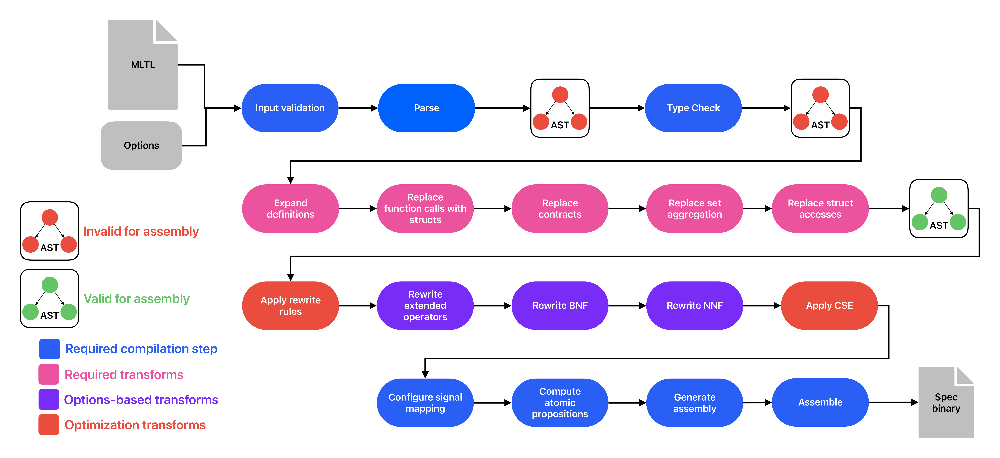

# C2PO Internal Architecture
C2PO has a fairly standard compiler architecture -- parses input into an abstract syntax tree (AST), type checks the AST, performs various transformations on the AST (simplification, optimizations), then outputs an assembly program that represents the original input.

The default transformation pipeline is:
1. Expand out all definitions from the `DEFINE` block
2. Change all valid "function calls" to struct declarations
3. Replace assume-guarantee contracts with 
4. Expand out all set aggregation operators
5. Change each struct access to its referenced data
6. Perform rewrite rule optimization
7. Rewrite extended operators
8. Rewrite to negative normal form
9. Rewrite to Boolean normal form
10. Perform common sub-expression elimination
